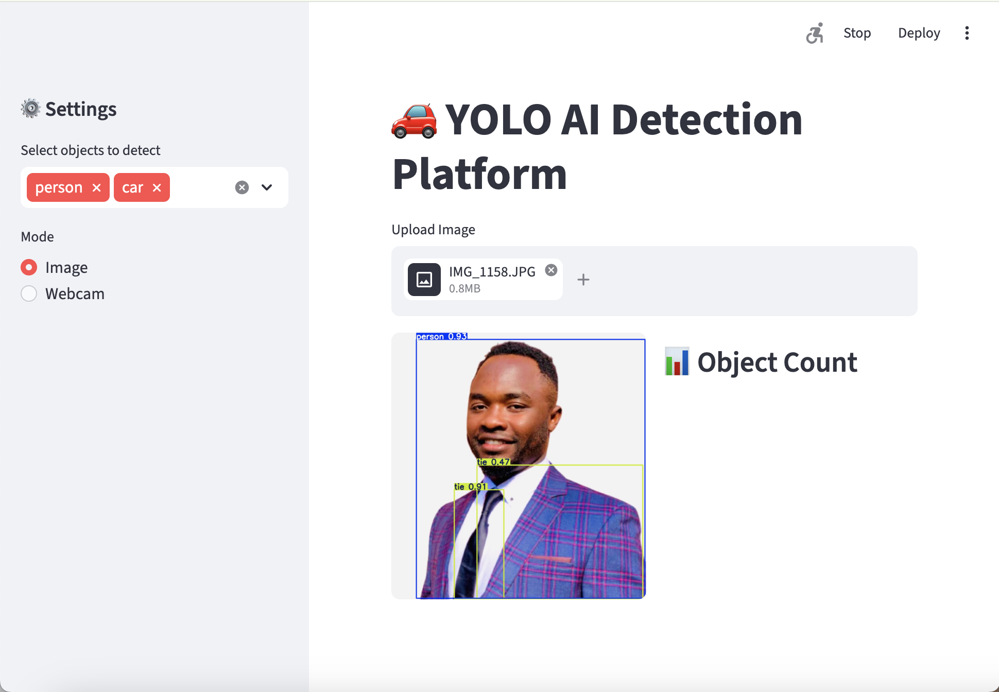

# 🚗 YOLOv8 Real-Time Object Detection Web App

## 📌 Overview

This project is a **real-time AI object detection system** built with YOLOv8, OpenCV, and Streamlit.
It detects and counts objects such as **cars and people** from images and live webcam streams.

---

## 🎯 Features

* 🚀 Real-time object detection (YOLOv8)
* 🎥 Live webcam detection
* 📷 Image upload detection
* 🔍 Object filtering (cars & persons)
* 📊 Object counting
* ⚡ FPS monitoring
* 💾 Video recording
* 🌐 Interactive web interface (Streamlit)

---

## 🖥️ Demo



---

## 🧰 Tech Stack

* Python
* PyTorch
* OpenCV
* YOLOv8 (Ultralytics)
* Streamlit

---

## 📂 Project Structure

```bash
│── src/
│── app.py
│── data/
│── outputs/
│── assets/
│── README.md
│── requirements.txt
```

---

## 🚀 Installation

```bash
git clone https://github.com/YOUR_USERNAME/yolo-object-detection.git
cd yolo-object-detection
pip install -r requirements.txt
```

---

## ▶️ Run the App

```bash
streamlit run app.py
```

---

## 💡 Use Cases

* Autonomous driving (basic perception)
* Smart surveillance systems
* Traffic monitoring

---

## 🔮 Future Improvements

* Custom dataset training (traffic signs 🇩🇪)
* Deployment (Docker / Cloud)
* Mobile integration

---

## 👨‍💻 Author

Larry Nelson Azanguim Azaguim Ndongmo